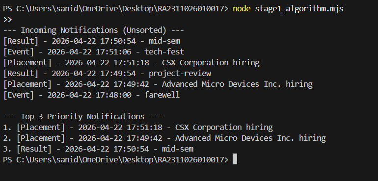

# Stage 1

## Priority Inbox Architecture & Algorithm Design

### Objective
The goal is to implement a "Priority Inbox" that always displays the top 'n' most important unread notifications. Priority is determined by a combination of weight (`Placement` > `Result` > `Event`) and recency (timestamp).

### Priority Logic
To establish a clear hierarchy, we assign numeric weights to each notification type:
- **Placement:** Weight 3 (Highest)
- **Result:** Weight 2
- **Event:** Weight 1 (Lowest)

When comparing two notifications, we first evaluate their assigned weights. If the weights are identical (e.g., two "Placement" notifications), the tie is broken by recency, favoring the notification with the more recent timestamp.

### Efficiently Maintaining the Top 10
As new notifications continuously arrive, resorting the entire dataset (which takes `O(N log N)` time) is highly inefficient and unscalable. 

To maintain the top 10 efficiently, the optimal data structure is a **Min-Heap (Priority Queue)** of size `k` (where `k = 10`).

**How it works:**
1. We initialize a Min-Heap that will hold exactly 10 notifications. The heap is ordered based on our priority logic, meaning the *lowest* priority notification among the top 10 is always at the root of the heap.
2. When a new notification arrives, we compare it to the root of the Min-Heap.
3. If the new notification has a *lower* priority than the root, we discard it.
4. If the new notification has a *higher* priority than the root, we extract (remove) the root and insert the new notification into the heap.
5. The heap automatically rebalances itself in `O(log k)` time.

**Time Complexity:** 
Processing a new incoming notification takes **O(log k)** time, where `k` is the size of the inbox (e.g., 10). Since `k` is a small constant, the operation is effectively **O(1)**, ensuring maximum performance regardless of how many thousands of notifications stream in.

### Output

---

# Stage 2

## Frontend — Campus Notification App

A responsive React application built with **Material UI** that displays campus notifications with a priority-based inbox and type filtering. Runs on `http://localhost:3000`.

### Features
- **All Notifications page** — View all notifications, filter by type (Placement / Result / Event), mark as read
- **Priority Inbox page** — Top-N ranked notifications (Placement > Result > Event, then by recency), adjustable via slider
- **Read / Unread distinction** — Unread cards have a colored left border accent; read cards are visually muted
- **Logging** — Every user action and API call is tracked via the custom `Log()` middleware

### Screenshots

#### Desktop

.png>)

.png>)

#### Mobile

.png>)

.png>)

.png>)

